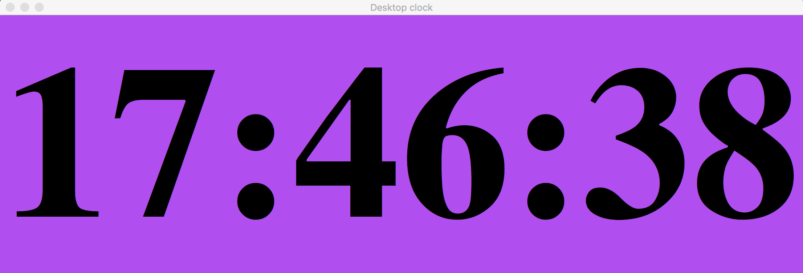

# Desktop digital clock
Simple desktop digital clock written in python.

## Demo


## Run unittests
Run script from the root directory of the project:
```bash
~ pytest -s -v
```

## Contributing
- clone the repository
- configure Git for the first time after cloning with your name and email
  ```bash
  git config --local user.name "Volodymyr Yahello"
  git config --local user.email "vyahello@gmail.com"
  ```
- `python3.6` is required to run the code
- run `pip install -r requirements.txt` to install all required python packages
